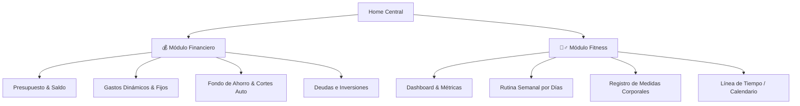
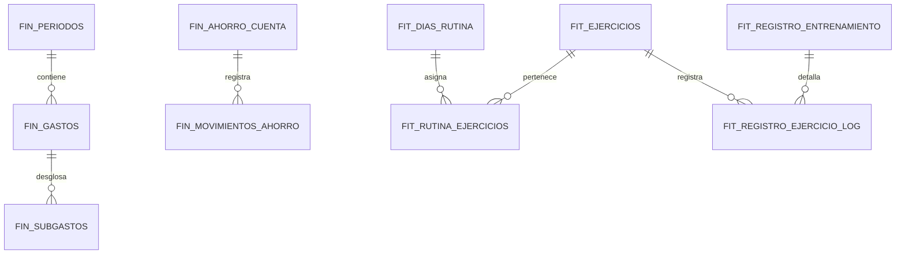
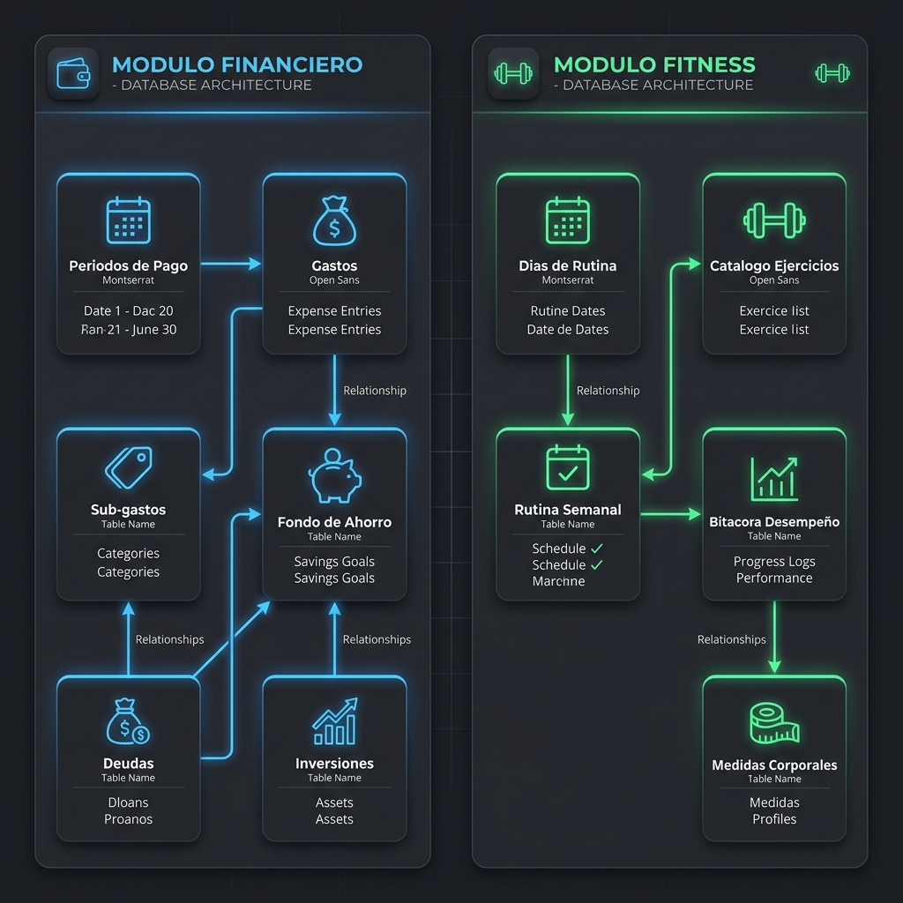

# 🚀 PersonalApp (Fit & Finance Hub)


**PersonalApp** es una aplicación móvil multiplataforma desarrollada en **React Native** diseñada para ser el centro de control definitivo del estilo de vida personal. Combina en una única interfaz fluida dos módulos esenciales: **Gestión Financiera Premium** y **Control de Entrenamiento & Evolución Física (MeloFit)**.

---

## 🎯 Filosofía del Proyecto

- **Sin Login / Acceso Inmediato**: No requiere registro ni inicio de sesión. Al abrir la app se accede inmediatamente a la **Home Central**, eliminando fricciones.
- **100% Local-First (Offline)**: Todos los datos residen en el dispositivo utilizando **SQLite**. Privacidad total, cero dependencia de servidores de terceros y respuestas ultrarrápidas.
- **Diseño Melo / Modern UI**: Estética *Dark Glassmorphism*, micro-animaciones, gráficos interactivos y retroalimentación háptica.

---

## 📱 Arquitectura de Navegación & Vistas



---

## 💰 Módulo Financiero (Finanzas Premium)

Diseñado para llevar un control riguroso de ingresos, egresos, deudas, inversiones y ahorro estructurado en periodos quincenales o mensuales.

### 🔑 Características Clave:

1. **Gestión de Periodos de Pago**:
   - Soporte para cobro **quincenal** (Día 15 - Q1 y Día 30 - Q2) o **mensual**.
   - Saldo dinámico que se calcula en tiempo real: `Saldo Disponible = Ingreso Base - Total Gastos`.

2. **Corte y Ahorro Automático (Algoritmo de Limpieza de Saldo)**:
   - Al llegar la fecha y hora de corte (ej: Día 30 a las 12:00 PM o Día 14/29):
     - El **Saldo Disponible** restante se transfiere automáticamente a la cuenta de **Ahorro Acumulado**.
     - El saldo del periodo pasa a `$0`, quedando "limpio" para recibir el nuevo sueldo.
     - *Ejemplo*: Si tenías `$120.000` de saldo y `$300.000` en ahorro, tras el corte tu ahorro pasa a `$420.000` y el saldo inicia en `$0` (listo para cargar el nuevo ingreso).

3. **Fondo de Ahorros Avanzado**:
   - **Formulario de Movimientos**: Registro de entradas/salidas voluntarias con campos: *Tipo (Ingreso/Egreso)*, *Valor*, *Fecha (Automática)* y *Descripción*.
   - **Aportes Voluntarios**: Opción para inyectar dinero extra al ahorro.
   - **Imprevistos / Novedades**: Opción para retirar dinero especificando la razón.
   - **Historial & Gráficas**: Bitácora detallada de movimientos y gráfico de barras/líneas para evaluar la evolución del fondo.

4. **Gestión Dinámica de Gastos & Sub-Gastos**:
   - **Gastos Fijos**: Registro de compromisos recurrentes (Renta, Servicios, Suscripciones) aplicables con un selector rápido.
   - **Desglose de Sub-gastos**: Permite crear una categoría contenedora y añadir/modificar/reducir ítems internos.
     - *Ejemplo*: Se crea el gasto `Gusticos` por `$12.000`. Si más tarde compras un helado de `$5.000`, lo agregas como sub-gasto dentro de `Gusticos`, actualizando automáticamente el total a `$17.000`.

5. **Módulos de Deudas e Inversiones**:
   - Control de cuentas por pagar con fechas límite y barra de progreso de abonos.
   - Registro de activos/inversiones con porcentaje de rendimiento proyectado.

---

## 🏋️‍♂️ Módulo Fitness (MeloFit)

Planificador de entrenamiento y rastreador de evolución antropométrica con interfaz organizada por días de la semana y control de hábitos.

### 🔑 Características Clave:

1. **Bottom Navigation & Rutina Semanal**:
   - Barra inferior con pestañas asignadas a los días de la semana (*Lunes a Domingo*) más el *Dashboard Principal*.
   - Cada día muestra la rutina asignada con su enfoque muscular (ej. *Lunes: Pecho & Tríceps*).

2. **Tarjetas de Ejercicio Interactivas**:
   - Fichas con imagen/GIF animado demostrativo de la técnica.
   - Nombre del ejercicio, grupo muscular objetivo, series objetivo y rango de repeticiones.
   - Checkbox animado de estado completado por serie/ejercicio.

3. **Métricas de Progreso Físico & Antropometría**:
   - Registro de variables corporales clave:
     - **Peso corporal (kg)** y **% de Grasa Corporal**.
     - **Medidas Corporales (cm)**: Brazo, Pierna, Muslo, Pantorrilla, Cintura y Cadera.
   - Gráficos de tendencias para visualizar hipertrofia o pérdida de grasa en el tiempo.

4. **Línea de Tiempo & Heatmap de Asistencia**:
   - Calendario tipo mapa de calor para marcar los días en que se asistió al gimnasio.
   - Contador de racha (*Streak*) de días consecutivos o entrenados por mes.

---

## 🗄️ Estructura de Base de Datos (SQLite Relacional)

La base de datos relacional utiliza SQLite local. A continuación se presenta el diagrama Entidad-Relación y los scripts de creación de tablas (**DDL**).

### 📐 Diagrama ER (Mermaid)



### 🗺️ Mapa Conceptual Visual de Datos

El siguiente mapa conceptual ilustra el flujo de información y el propósito de cada tabla para comprender el sistema sin necesidad de leer código:



```text
==========================================================================================
                     🗺️ MAPA CONCEPTUAL DE LA BASE DE DATOS (RELACIONES)
==========================================================================================

   [ 💳 MÓDULO FINANCIERO ]                            [ 🏋️‍♂️ MÓDULO FITNESS ]
   
     +-------------------+                              +-------------------+
     |   fin_periodos    |                              |  fit_dias_rutina  |
     | (Mes/Quincena Q1) |                              | (Lunes a Domingo) |
     +---------+---------+                              +---------+---------+
               |                                                  |
               | (1 a Muchos)                                     | (1 a Muchos)
               v                                                  v
     +---------+---------+                              +---------+---------+
     |    fin_gastos     |                              | fit_rutina_ejerc  | <---+ (1 a M)
     | (Agrupador: Ocio) |                              |  (Series/Repetic) |     |
     +---------+---------+                              +-------------------+     |
               |                                                                  |
               | (1 a Muchos)                                                     |
               v                                                                  |
     +---------+---------+                              +-------------------+     |
     |   fin_subgastos   |                              |  fit_ejercicios   | ----+
     | (Helado, Cine...) |                              | (P. Banca, Squat) |
     +-------------------+                              +---------+---------+
                                                                  |
                                                                  | (1 a Muchos)
     +-------------------+                                        v
     | fin_ahorro_cuenta |                              +---------+---------+
     | (Balance General) | <--- [Traspaso Auto]         | fit_reg_ejerc_log | <---+
     +---------+---------+       al finalizar           | (Peso/Repes Real) |     |
               |                 el periodo             +-------------------+     |
               | (1 a Muchos)                                                     |
               v                                                                  | (1 a M)
     +---------+---------+                              +-------------------+     |
     | fin_mov_ahorro    |                              | fit_reg_entrena   | ----+
     | (Retiro/Depósitos)|                              | (Asistencia/Fecha)|
     +-------------------+                              +-------------------+

   [ INDEPENDIENTES ]
   
     +-------------------+   +-------------------+      +-------------------+
     |    fin_deudas     |   |  fin_inversiones  |      |  fit_med_corporal |
     |  (Por pagar/caja) |   | (Activos/Rendim.) |      | (Peso, grasa, cm) |
     +-------------------+   +-------------------+      +-------------------+
==========================================================================================
```

#### 📖 Explicación del Mapa de Datos

##### **Flujo Financiero 💰**
*   **Ciclo de Ingresos y Egresos:** Cada **Periodo de Pago** (sea quincenal o mensual) inicia con un saldo. De este saldo se van restando los **Gastos**.
*   **Gastos Desglosables:** Si un gasto requiere desglose (como compras hormiga en la calle o supermercado), la tabla **Sub-Gastos** permite sumar componentes dinámicamente y acumular su costo.
*   **Automatización de Ahorro:** Al finalizar la quincena/mes, el saldo sobrante no se pierde, se transfiere directamente al **Fondo de Ahorros** (`fin_ahorro_cuenta`), registrando la operación en el **Historial de Movimientos** para generar gráficos históricos de salud financiera.

##### **Flujo Fitness 🏋️‍♂️**
*   **Planificación Semanal:** Los **Días de Rutina** definen qué se entrena hoy (ej. Lunes). A través de la tabla intermedia **Rutina por Día**, vinculamos los **Ejercicios** del catálogo para armar nuestra rutina con objetivos específicos de series y repeticiones.
*   **Rendimiento en Vivo:** Cada vez que vas al gimnasio, se marca una asistencia en el **Registro Diario**. De allí, apuntas en la **Bitácora de Desempeño** cuánto peso cargaste y cuántas repeticiones lograste realmente.
*   **Evolución Estética:** De manera independiente, en **Medidas Corporales** vas apuntando tus cambios físicos (peso, cintura, brazo) para graficar si estás ganando músculo o perdiendo grasa.

---

---

### 📜 Script DDL en SQL (SQLite)

```sql
-- ==========================================
-- HABILITAR LLAVES FORÁNEAS EN SQLITE
-- ==========================================
PRAGMA foreign_keys = ON;

-- ==========================================
-- MÓDULO FINANCIERO
-- ==========================================

-- 1. Periodos de Presupuesto (Quincenal / Mensual)
CREATE TABLE IF NOT EXISTS fin_periodos (
    id INTEGER PRIMARY KEY AUTOINCREMENT,
    nombre TEXT NOT NULL,                             -- ej: 'Quincena 1 - Julio 2026'
    tipo TEXT CHECK(tipo IN ('quincenal_15', 'quincenal_30', 'mensual')) NOT NULL,
    ingreso_base REAL DEFAULT 0.0,
    fecha_inicio DATE NOT NULL,
    fecha_corte DATE NOT NULL,
    activo INTEGER DEFAULT 1 CHECK(activo IN (0, 1))
);

-- 2. Gastos Principales
CREATE TABLE IF NOT EXISTS fin_gastos (
    id INTEGER PRIMARY KEY AUTOINCREMENT,
    periodo_id INTEGER NOT NULL,
    titulo TEXT NOT NULL,                             -- ej: 'Renta', 'Gusticos'
    monto_total REAL DEFAULT 0.0,
    es_fijo INTEGER DEFAULT 0 CHECK(es_fijo IN (0, 1)),
    categoria TEXT DEFAULT 'Varios',                  -- ej: 'Hogar', 'Ocio', 'Comida'
    fecha_creacion DATETIME DEFAULT CURRENT_TIMESTAMP,
    FOREIGN KEY (periodo_id) REFERENCES fin_periodos(id) ON DELETE CASCADE
);

-- 3. Sub-gastos (Desglose Dinámico de Gastos)
CREATE TABLE IF NOT EXISTS fin_subgastos (
    id INTEGER PRIMARY KEY AUTOINCREMENT,
    gasto_id INTEGER NOT NULL,
    descripcion TEXT NOT NULL,                        -- ej: 'Helado', 'Cine'
    monto REAL NOT NULL,
    fecha DATETIME DEFAULT CURRENT_TIMESTAMP,
    FOREIGN KEY (gasto_id) REFERENCES fin_gastos(id) ON DELETE CASCADE
);

-- 4. Cuenta Principal de Fondo de Ahorro
CREATE TABLE IF NOT EXISTS fin_ahorro_cuenta (
    id INTEGER PRIMARY KEY AUTOINCREMENT,
    balance_total REAL DEFAULT 0.0,
    ultima_actualizacion DATETIME DEFAULT CURRENT_TIMESTAMP
);

-- 5. Historial de Movimientos de Ahorro
CREATE TABLE IF NOT EXISTS fin_movimientos_ahorro (
    id INTEGER PRIMARY KEY AUTOINCREMENT,
    tipo TEXT CHECK(tipo IN ('ingreso_voluntario', 'egreso_imprevisto', 'corte_automatico')) NOT NULL,
    monto REAL NOT NULL,
    descripcion TEXT NOT NULL,
    fecha DATETIME DEFAULT CURRENT_TIMESTAMP
);

-- 6. Módulo de Deudas
CREATE TABLE IF NOT EXISTS fin_deudas (
    id INTEGER PRIMARY KEY AUTOINCREMENT,
    acreedor_concepto TEXT NOT NULL,
    monto_total REAL NOT NULL,
    monto_pagado REAL DEFAULT 0.0,
    fecha_limite DATE,
    estado TEXT CHECK(estado IN ('pendiente', 'pagado')) DEFAULT 'pendiente'
);

-- 7. Módulo de Inversiones
CREATE TABLE IF NOT EXISTS fin_inversiones (
    id INTEGER PRIMARY KEY AUTOINCREMENT,
    plataforma_concepto TEXT NOT NULL,
    monto_invertido REAL NOT NULL,
    rendimiento_esperado_porcentaje REAL DEFAULT 0.0,
    fecha_inicio DATE NOT NULL
);


-- ==========================================
-- MÓDULO FITNESS (MELOFIT)
-- ==========================================

-- 8. Días de Rutina Semanal
CREATE TABLE IF NOT EXISTS fit_dias_rutina (
    id INTEGER PRIMARY KEY AUTOINCREMENT,
    dia_semana TEXT CHECK(dia_semana IN ('lunes', 'martes', 'miercoles', 'jueves', 'viernes', 'sabado', 'domingo')) NOT NULL UNIQUE,
    enfoque TEXT NOT NULL,                            -- ej: 'Pecho y Tríceps'
    descripcion TEXT
);

-- 9. Catálogo de Ejercicios
CREATE TABLE IF NOT EXISTS fit_ejercicios (
    id INTEGER PRIMARY KEY AUTOINCREMENT,
    nombre TEXT NOT NULL UNIQUE,                      -- ej: 'Press de Banca Inclinado'
    grupo_muscular TEXT NOT NULL,                     -- ej: 'Pecho'
    descripcion TEXT,
    gif_url TEXT                                      -- Ruta local o URL de demostración
);

-- 10. Relación Día - Ejercicio (Rutina Asignada)
CREATE TABLE IF NOT EXISTS fit_rutina_ejercicios (
    id INTEGER PRIMARY KEY AUTOINCREMENT,
    dia_id INTEGER NOT NULL,
    ejercicio_id INTEGER NOT NULL,
    orden INTEGER DEFAULT 1,
    series_target INTEGER NOT NULL DEFAULT 4,
    repeticiones_target TEXT NOT NULL DEFAULT '10-12', -- ej: '12', '10-12', 'Fallo'
    FOREIGN KEY (dia_id) REFERENCES fit_dias_rutina(id) ON DELETE CASCADE,
    FOREIGN KEY (ejercicio_id) REFERENCES fit_ejercicios(id) ON DELETE CASCADE
);

-- 11. Registro Diario de Entrenamiento (Heatmap / Asistencia)
CREATE TABLE IF NOT EXISTS fit_registro_entrenamiento (
    id INTEGER PRIMARY KEY AUTOINCREMENT,
    fecha DATE NOT NULL UNIQUE,                       -- YYYY-MM-DD
    dia_id INTEGER NOT NULL,
    completado INTEGER DEFAULT 0 CHECK(completado IN (0, 1)),
    notas TEXT,
    FOREIGN KEY (dia_id) REFERENCES fit_dias_rutina(id)
);

-- 12. Log de Desempeño por Ejercicio Realizado
CREATE TABLE IF NOT EXISTS fit_registro_ejercicio_log (
    id INTEGER PRIMARY KEY AUTOINCREMENT,
    entrenamiento_id INTEGER NOT NULL,
    ejercicio_id INTEGER NOT NULL,
    series_completadas INTEGER DEFAULT 0,
    repeticiones_realizadas INTEGER DEFAULT 0,
    peso_utilizado_kg REAL DEFAULT 0.0,
    completado INTEGER DEFAULT 0 CHECK(completado IN (0, 1)),
    FOREIGN KEY (entrenamiento_id) REFERENCES fit_registro_entrenamiento(id) ON DELETE CASCADE,
    FOREIGN KEY (ejercicio_id) REFERENCES fit_ejercicios(id)
);

-- 13. Historial de Medidas Corporales & Antropometría
CREATE TABLE IF NOT EXISTS fit_medidas_corporales (
    id INTEGER PRIMARY KEY AUTOINCREMENT,
    fecha DATE NOT NULL UNIQUE,                       -- YYYY-MM-DD
    peso_kg REAL,
    porcentaje_grasa REAL,
    brazo_cm REAL,
    pierna_cm REAL,
    muslo_cm REAL,
    pantorrilla_cm REAL,
    cintura_cm REAL,
    cadera_cm REAL,
    notas TEXT,
    fecha_registro DATETIME DEFAULT CURRENT_TIMESTAMP
);


-- ==========================================
-- ÍNDICES DE OPTIMIZACIÓN
-- ==========================================
CREATE INDEX IF NOT EXISTS idx_fin_gastos_periodo ON fin_gastos(periodo_id);
CREATE INDEX IF NOT EXISTS idx_fin_subgastos_gasto ON fin_subgastos(gasto_id);
CREATE INDEX IF NOT EXISTS idx_fin_mov_ahorro_fecha ON fin_movimientos_ahorro(fecha);
CREATE INDEX IF NOT EXISTS idx_fit_rutina_dia ON fit_rutina_ejercicios(dia_id);
CREATE INDEX IF NOT EXISTS idx_fit_log_entrenamiento ON fit_registro_ejercicio_log(entrenamiento_id);
CREATE INDEX IF NOT EXISTS idx_fit_medidas_fecha ON fit_medidas_corporales(fecha);
```

---

## 🛠️ Stack Tecnológico Recomendado

| Categoría | Tecnología / Librería | Propósito |
| :--- | :--- | :--- |
| **Framework Base** | `React Native` + `Expo SDK 51+` | Desarrollo móvil nativo multiplataforma (iOS & Android) |
| **Navegación** | `React Navigation v6` | Bottom Tabs + Stack Navigator nativo |
| **Base de Datos** | `expo-sqlite` / `Drizzle ORM` | Motor de base de datos relacional offline |
| **Estilos & UI** | `NativeWind` (TailwindCSS) / `Lucide Icons` | Componentes con estética Dark Premium e iconos modernos |
| **Gráficos** | `react-native-gifted-charts` | Gráficos interactivos de líneas, barras y donas |
| **Alertas & Feedback** | `react-native-reanimated` + `Haptics` | Animaciones fluidas y respuesta háptica nativa |

---

## 📋 Próximos Pasos para el Desarrollo

1. **Configuración del Motor SQLite**: Implementar la capa de servicios SQLite (`database/schema.ts` y `database/queries.ts`) ejecutando las sentencias DDL al iniciar la app.
2. **Desarrollo de la Home Central**: Maquetar los botones de entrada a los módulos Financiero y Fitness con indicadores resumen (Saldo actual y Rutina del día).
3. **Módulo Financiero**: Implementar la lógica del worker/cron local de corte quincenal y la interfaz para sub-gastos dinámicos.
4. **Módulo Fitness**: Maquetar la navegación por días de la semana y conectar los visores de GIFs e historiales de medidas corporales.
